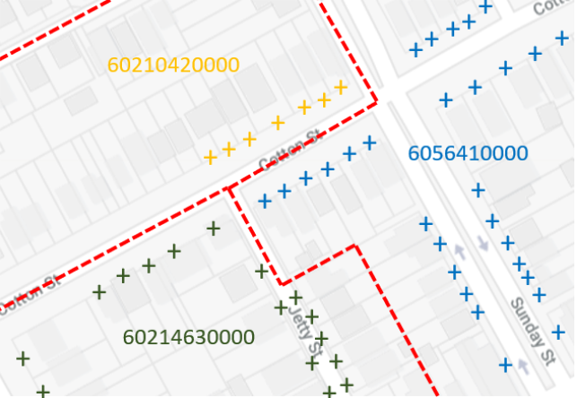

# Current Addresses to 2011 Mesh Block Linkset
Spatial associations between Address objects in the latest version of the Geocoded National Address File (GNAF Current) and Mesh Block objects in the 2011 version of the Australian Statistical Geography Standard (ASGS 2011).

Addresses, in the [GNAF Current dataset](http://linked.data.gov.au/dataset/gnaf), are linked to spatial points and Mesh Blocks, in [ASGS 2011](http://linked.data.gov.au/dataset/asgs2011), are represented spatially as polygons. Mesh Blocks do not overlap and cover all of Australia, so any GNAF Current Address will lie within one, and only one, Mesh Block.

  
**Figure 1**: Several Mesh Blocks (red borders) with some of the Addresses points (‘+’ symbols) within them shown

## Repository Contents  
* [data.ttl.tar.gz](data.ttl.tar.gz) - this Linkset’s main data file. It is a compressed RDf turtle file, 50 MB.
* [header.ttl](header.ttl) - this Linkset’s data.ttl header information, stored separately for ease of access
* [example-data.ttl](example-data.ttl) - 10 Statements from the Linkset for ease of access
* [README.md](README.md) - this file
* [LICENSE](LICENSE) - the data license assigned to this Linkset’s content
* [overview](overview.png) - the image above

## Purpose
This Dataset is a [Linkset](http://linked.data.gov.au/def/loci#Linkset) which are specialised datasets that link objects, such as Addresses or Catchments, in one dataset to objects in another. 

Publishing relationships between Datasets as distinct Linksets allows for the independent management of Dataset-to-Dataset relationships.

### Linksets for Spatial Relationships
Where LocI objects across multiple datasets have spatial relationships that we wish to represent, we create Linksets with spatial (topological) relationships such as touches, within, overlaps etc. using terms formalised in the (GeoSPARQL Standard](https://www.opengeospatial.org/standards/geosparql). 

### Linksets for Dataset versions
Some LocI Datasets, such as the ASGS, have multiple, independently delivered versions (the ASGS is released as a Linked Data Datasets in both [2011](http://linked.data.gov.au/dataset/asgs2011) and [2016](http://linked.data.gov.au/dataset/asgs2016) versions). Linksets can be used to link between these versions of a Dataset too. This allows for information such as correspondence tables (links between ASGS versions, published by the Australian Bureau of Statistics) to be published as Linked Data independently of any other Dataset.

### This Linkset
This Linkset - Current Addresses to 2011 Mesh Block Linkset - is a spatial relations Linkset linking GNAF Current Addresses (points) to ASGS 2011 Mesh Blocks (polygons) by indicating which Mesh Block each Address is within. 

This Linkset states, per Address and with other details, something like this:

Address GAACT718763866  
*is within*  
Mesh Block 80036981000  

...and that this particular link was made on the 6th of February, 2015 using a Parcel Level matching method.

## How is a Linkset’s data organised?
Linksets include the main facts of relations between objects in two datasets - what the IDs of two objects are and how they are related - and they also include information about how links were created, such as what spatial intersection method was used to establish a topological relation. Linkset generation might have employed multiple methods to make all the object-to-object links within it so a Linkset may relate multiple methods and give the particular method used for each link. 

Other per-link information may be recorded too: if the links within a Linkset are generated over a significant period of time then the each link may have a created time; if different people/organisations contributed different links then each link may reference their specific contributor.

### Linkset content sections
Linksets use a highly condensed, but still (sort of) human-readable data format to include many (millions) of links. Linkset data file contain:

* **A header**
  * Basic information about the Linksets - what, who when
  * Links to methods used in the generation of the Linkset
* **A (long) set of Statements**
  * One Statement per link
  * Link type, time of creation (if important), method used and who created it (if known)

Linksets include all their information in one potentially very large file but they also include the header information in a stand-alone text file - header.ttl.

They also include a few (perhaps 10) example Statements in a stand-alone text file - example-data-… .ttl (numbered as there may be many).

### Linkset files
In addition to the main Linkset data file and the header.ttl and example-data.ttl files, there are usually several other files within a Linkset, including this README file. General Linkset files are:

* **data.ttl** - the main Linkset data file. This could be very large (1.5GB) and some deliveries of a Linkset (e.g. in GitHub) only provide a hyperlink to download the data file, not the data file itself.
* **header.ttl** - the Linkset’s data.ttl header information, stored separately for ease of access
* **example-data.ttl** - a few statements (perhaps 10) from the Linkset for ease of access
* **README.md** - this file: a description of this Linkset and general Linkset information
* **LICENSE** - the data license assigned to this Linkset’s content

This specific Linkset’s files are listed in above in Repository Content.

## Rights & License
The content of this API is licensed for use under the [Creative Commons 4.0 License](https://creativecommons.org/licenses/by/4.0/). See the [license deed](LICENSE) all details.

## Contacts
*LocI Project technical owner*:  
Nicholas Car  
CSIRO Land & Water, Environmental Informatics Group  
<nicholas.car@csiro.au>  

*Linkset creator*:
Edmond Chuc  
CSIRO Land & Water, Environmental Informatics Group  
<edmond.chuc@csiro.au>  
